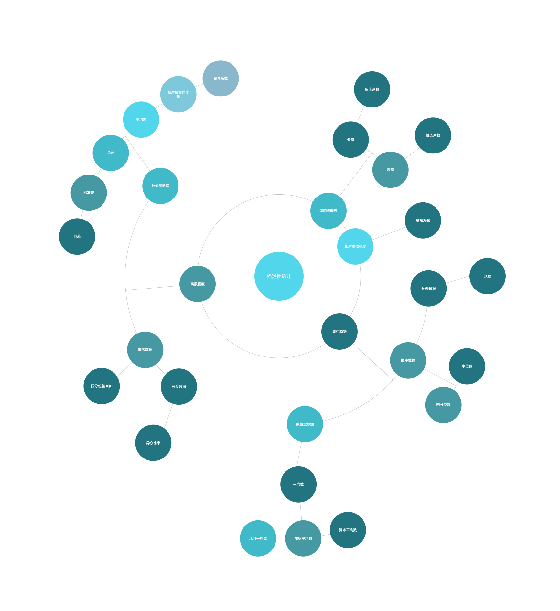

# 描述性统计分析

> 描述性统计，即概括性度量。是用来概括、表述事物整体状况以及事物间关联、类属关系的统计方法。通过统计处理可以简洁地用几个统计值来表示一组数据地集中性和离散型 (波动性大小)。

利用`图表`展示数据，可以让我们对数据的**分布形状**与**特征**有初步的了解。但要全面把握数据分布的特定，还需要找到反映数据分布特征的各个代表值。

## 集中趋势

指一组数据向某一中心**靠拢**的程度，反映了一组数据中心点的位置所在。

### 众数

- 一组数据中**出现次数最多**的变量值 $ {M_o} $
- 一般在数据量较大的情况下，众数才有意义
- 众数是一个**位置代表值**，不受数据中极端值的影响
- 众数可能不存在；也可能存在多个众数
- Excel 中可以使用 `MODE` 函数计算， ``MODE(number1, number2, ...)``

### 中位数

- 一组数据**排序后处于中间位置**上的变量值 $ {M_e}$
- 将全部数据等分成两个部分。每部分包含 50% 的数据
- 不适用于分类数据
- 中位数是一个**位置代表值**，不受数据中极端值的影响
- 中位数位置 = $ \dfrac{n+1}{2} $ , n 为数据个数
- 中位数$$ {M_e} = \begin{cases}
x\left(\frac{n + 1}{2}\right),  n为奇数 \\
\dfrac{1}{2}\{ x\left(\frac{n}{2}\right)+ x\left(\frac{n+1}{2}\right)\}, n为偶数
\end{cases}$$
- Excel 中可以使用 `MEDIAN` 函数计算， ``MEDIAN(number1, number2, ...)``

### 四分位数

- 一组数据**排序后处于 25% 和 75% 位置**上的值 $ {Q_L}$ 和  $ {Q_U}$
- 通过 3 个点将全部数据等分成 4 个部分，每个部分包含 25% 的数据
- Excel 中可以使用 `QUARTILE` 函数计算， ``QUARTILE(array, quart)``，`arry` 为求四分位数的数组或者数字的单元格区域， `quart` 决定返回哪一个四分位数
- $ {Q_L}$ 位置 = $ \dfrac{n}{4} $
- $ {Q_U}$ 位置 = $ \dfrac{3n}{4} $

### 平均数

- 一组数据**相加后除以数据的个数**得到的结果
- 是集中趋势的**最主要测度值**
- 主要适用于**数值型数据**
- 不适用于分类数据和顺序数据
- 是进行统计分析和统计推断的基础
- 从统计学上看，平均数是一组数据的重心所在，是**数据误差相互抵消后的必然结果**

#### 简单平均数

- **未经分组数据**计算的平均数
- $ \overline{x} $ = $ \dfrac{x_1 + x_2 + ... + x_n}{n} $ = $ \dfrac{\sum_{i=1}^{n} x_i }{n} $

#### 加权平均数

- **根据分组数据**计算的平均数
- $ \overline{x} $ = $ \dfrac{M_1f_1 + M_2f_2 + ... + M_kf_k}{f_1+f_2+...f_k} $ = $ \dfrac{\sum_{i=1}^{k} M_if_i}{n} $

#### 几何平均数

- 是 n 个变量值乘积的 n 次方根 G
- 适用于特殊数据的一种平均数，主要用于计算平均比率
- 在实际应用中，主要用于计算现象的平均增长率
- G = $ \sqrt[n]{x_1×x_2×...×x_n} $ = $ \sqrt[n]{\prod_{i=1}^{n}{x_i}} $

### 众数、中位数和平均数的比较

- 如果数据分布为**对称**的，则有 $ M_o = M_e = \overline{x} $
- 如果数据分布为**左偏**的，则有 $ \overline{x} < M_e< M_o  $
- 如果数据分布为**右偏**的，则有 $ M_o < M_e < \overline{x} $
- 当数据呈**对称分布或接近对称分布**时，应选择`平均数`作为集中趋势的代表值
- 当数据呈**偏态分布**时，尤其是偏斜程度较大时，应考虑`中位数`或`众数`，会有更好的代表性

## 离散程度

### 异众比率

- 指**非众数组**的频数占总频数的比例 $ V_r $
- 主要用于衡量众数对一组数据的代表程度
- $ V_r $ = $ { \dfrac{\sum f_i - f_m }{\sum f_i}} = 1- \dfrac{f_m}{\sum f_i}$

### 四分位差

- 也称**内距**或**四分间距**，是上四分位数与下四分位数之差 $ Q_d $
- 反映了中间 50% 的数据的离散程度，四分位差越小，说明中间的数据越集中；四分位差越大，说明中间的数据越分散
- 不受极值的影响
- 一定程度上说明了中位数对一组数据的代表程度
- $ Q_d = Q_U - Q_L $

### 方差与标准差

#### 极差

- 一组数据的**最大值与最小值之差**，也称全距 R
- 容易受极端值的影响
- $ R = max(x_i)-min (x_i) $

#### 平均差

- 也称平均绝对离差，是各变量值与其平均数离差绝对值的平均数 $ M_d $
- 反映了每个数据与平均数的平均差异程度，能全面准确地反映一组数据的离散状况，平均差越大，说明数据的离散程度越大；平均差越小，说明数据的离散程度越小
- 未分组情况下 $ M_d = \dfrac{\sum_{i=1}^{n}|x_i-\overline{x}|}{n} $
- 分组情况下 $ M_d =\dfrac{\sum_{i=1}^{k}|M_i-\overline{x}|f_i}{n} $

#### 方差与标准差

- `方差`是各变量值与其平均数离差平方的平均数
- `方差`的**平方根**称为`标准差`
- 能较好地反映出数据的离散程度，是应用最广泛的离散程度的测度值
- 实际应用中更多使用`标准差`
- Excel 中可以使用 `STDEV` 函数计算， ``STDEV(number1, number2, ...)``
- `样本方差`是用**样本数据个数减1**后去除离差平方和
- 未分组数据的`样本方差` $ s^2 = \dfrac{\sum_{i=1}^{n}(x_i- \overline{x})^2}{n-1} $
- 分组数据的`样本方差` $ s^2 = \dfrac{\sum_{i=1}^{k}(M_i- \overline{x})^2f_i}{n-1} $
- 未分组数据的`标准差`  $ s^2 = \sqrt{\dfrac{\sum_{i=1}^{n}(x_i- \overline{x})^2}{n-1} } $
- 分组数据的`标准差`  $ s^2 = \sqrt{\dfrac{\sum_{i=1}^{k}(M_i- \overline{x})^2f_i}{n-1} }$

#### 相对位置的度量

- 有`平均数`和`标准差`后，可以计算一组数据中各个数据的`标准分数`，以测度每个数据在该组数据中的**相对位置**，并用来判断一组数据中是否有**离群数据**

##### 标准分数

- 是变量值和其平均数的离差除以标准差后的值，也称标准化值 $z$
- $z_i = \dfrac{x_i-\overline{x}}{s}$

##### 经验法则

- 当一组数据**对称分布**时
    - 约有 68% 的数据在平均数 ± 1 个标准差的范围内
    - 约有 95% 的数据在平均数 ± 2 个标准差的范围内
    - 约有 99% 的数据在平均数 ± 3 个标准差的范围内
- 不适用于**不对称分布**数据

##### 切比雪夫不等式

- 对于**任何分布形态**的数据，根据`切比雪夫不等式`，至少有 $ (1-\dfrac{1}{k^2}) $ 的数据落在 ± k 个标准差之内，其中 k 是大于 1 的任意值，但不一定是整数

## 离散系数

- 也称为变异系数，是一组数据的标准差与其相应的平均数之比
- 是测度数据**离散程度**程度的统计量，主要用于比较不同样本数据的离散程度，离散系数大，说明数据的离散程度大；离散系数小，说明数据的离散程度小
- $ v_s = \dfrac{s}{\overline{x}} $

## 偏态与峰态(分布形态)

### 偏态及其测度

- 是对**数据分布对称性**的测度
- 统计量是`偏态系数` SK
- 如果一组数据是**对称**的，则`偏态系数` 等于 **0**，不等于 **0** 则说明分布是**不对称**的
- 如果`偏态系数` 大于 **1** 或者小于 **-1**，称为**高度偏态分布**
- 如果`偏态系数` 在 **0.5 ~ 1** 或 **-1 ~ -0.5** 之间，则认为是**中等偏态分布**
- `偏态系数`越接近 **0**，**偏斜程度**越小
- Excel 中可以使用 `SKEW` 函数计算， ``SKEW(number1, number2, ...)``， 如果数据点少于 3 个，或者样本标准差为 0，则返回错误值
- 未分组的`偏态系数` $ SK = \dfrac{n \sum (x_i - \overline{x})^3}{(n-1)(n-2)s^3} $ , $ s^3 $ 是`样本标准差`的三次方
- 未分组的`偏态系数` $ SK = \dfrac{\sum_{i=1}^{k} (M_i - \overline{x})^3f_i}{ns^3} $ , $ s^3 $ 是`样本标准差`的三次方

### 峰态及其测度

- 是对**数据分布平峰或尖峰程度**的测度
- 统计量是`峰态系数` K
- 通常是与**标准正态分布**相比较而言的
- 如果一组数据**服从正态分布**，则`峰态系数`的值等于 **0**
- 如果`峰态系数`的值不等于 **0**，则可能存在**平峰分布**或者**尖峰分布**，需要根据实际标准比较
- Excel 中可以使用 `KURT` 函数计算， ``KURT(number1, number2, ...)``， 如果数据点少于 4 个，或者样本标准差为 0，则返回错误值
- 未分组的`峰态系数` $ K = \dfrac{n(n+1)\sum (x-\overline{x})^4-3[\sum(x_i-\overline{x})^2]^2(n-1)}{(n-1)(n-2)(n-3)s^4} $
- 分组的`峰态系数` $ K = \dfrac{\sum_{i=1}^{k}(M_i-\overline{x})^4f_i}{ns^4} -3$

## 脑图整理

## 参考资料

- 《统计学(第七版)》-贾俊平 ，中国人民大学出版社

